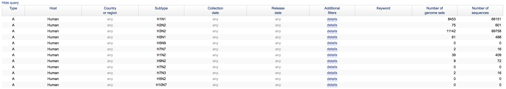

# SmaltAlign

A consensus calling pipeline provided in Bash.

Initially, the pipeline was used to make quick alignments of fastq reads against a reference using smalt, now it’s mainly used for HIV and HCV consensus generation for diagnostics.

It does the following:
 1. Subsample reads with seqtk (optional).
 2. Make de novo alignment of sampled reads with velvet.
 3. If more than one reference is provided into `<reference_file>`, then it runs `select_ref_whole.py`, which selects the best reference sequence for each FASTQ file.
 4. Align sampled reads (and only in the first iteration de novo contigs in triplicate) against reference with smalt.
 5. Create consensus with freebayes.
 6. Create vcf with lofreq.
 7. Calculate depth with samtools.
 8. If max number of iteration reached, call the final consensus sequence using final vcf file and the given ambiguity threshold. Otherwise, repeat from step 3.
 9. `cov_plot.R` plots the coverage of all iterations.
 10. `wts.R` combines consensus sequence, variants and coverage for the last iteration.

All the necessary references are in the References directory. 
Further information about cov_plot.R and wts.R is provided below.

#### Use conda environment from file
To ensure you have all dependencies needed for SmaltAlign installed you can use the `environment.yml` file.  
First you need to have [Conda](https://conda.io/docs/install/quick.html) installed).  
With the command `conda env create -f <path>/environment.yml` you will create a copy of the smaltalign environment.  
You enter the environment with the command `conda activate smaltalign` (and leave it with `conda deactivate`).  
For more information visit following link to [Managing environments](https://conda.io/docs/using/envs.html).

## smaltalign.sh

##### Usage
smaltalign.sh -r <reference_file> [options] <fastq_file/directory>  
Options:  
	[-h or --help]  
	[-n or --numreads]  
	[-i or --iterations]  
	[-t or --varthres]  
	[-c or --mincov]  
	[-o or --outdir]  
	[-d or --indels]  

Run `smaltalign.sh -h` for detailed information of the options and the default parameters.

##### Reference file
If you would like to run the script using one specific reference sequence, you can specify this reference into `<reference_file>` (in fasta format).  
However, if you are not sure about the closest reference sequence, you can also specify several probable reference sequences in `<reference_file>` (only one file with all the sequences in fasta format). In this case, the script chooses the closest reference sequence from the set of given sequences and constructs the consensus sequence based on that.

##### Fastq file / directory
If you would like to analyse only one FASTQ file at a time, you can specify it into `<fastq_file/directory>`. In this case, you can specify either the folder where the file is located, or the file itself.
However, if you would like to anlayse multiple FASTQ files at a time, you can specify the folder to all the FASTQ files into `<fastq_file/directory>`. In this case, you need to have all your FASTQ files in the same folder.

##### Number or freads
By default, the tool subsamples the sequencing reads to 200000. However, this number can be changed by the users.  
If you would like to analyse all sequencing reads without subsampling, then use -n "all".

## batch_influenza.sh

##### Usage
batch_influenza.sh [options]  
Options:  
	[-h or --help]  
	[-r or --refdir]  
	[-s or --sampledir]  
	[-n or --numreads]  
	[-i or --iterations]  
	[-t or --varthres]  
	[-c or --mincov]  
	[-o or --outdir]  

This script processes Influenza sequences with SmaltAlign:
1. Iteration over all `.fastq.gz` files in the current directory.
2. Create a folder for each sample containing segment 1-8 subfolders.
3. If a reference folder containing a reference per segment is not provided or does not exist, then it runs `select_ref_segments.py`, which selects the best reference sequence for each segment from a Influenza reference database (selected sequences from the [NCBI Influenza Virus Database](https://www.ncbi.nlm.nih.gov/genomes/FLU/Database/nph-select.cgi?go=database))

4. Using the best reference sequence, run `smaltalign.sh` for each segment, including `cov_plot.R` and `wts.R`.

## wts.R
`wts.R` is an R script to combine consensus sequence, variants and coverage for the last iteration of all `lofreq.vcf` files in a directory.  
It saves a `_x_WTS.fasta` file containing the consensus sequence with wobbles (at a certain threshold x) and a `.csv` file  containing coverage and variant frequencies for every position.  
The variant threshold and the minimal coverage have to be provided by the user either when using `smaltalign.sh` or `batch_influenza.sh`.

## cov_plot.R
`cov_plot.R` is an R script to plot and save the coverage of all iterations of all `.depth` files in the working directory.

## batch.sh
Used to run multiple samples in the current working directory with different references in one batch.  
To analyse the results of a Diagnostic sequencing run following steps need to be done:
* create a new folder in `/data/Diagnostics/experiments/` with the date of the sequencing run (start-date, yymmdd)
* in that new folder create links to the .fastq files you want to analyse (`ln -sv`) and copy the `SampleSheet.csv` of that run
* copy the `batch.sh` file into that new folder
* add the filenames (you can use `sampleID_to_filename.xltx`) to the empty virus arrays in `batch.sh` separated by a new line (works if you copy from the excel file)
* activate SmaltAlign environment (`source activate smaltalign`)
* execute `./batch.sh`

# Contributions
- Judith Bergadà-Pijuan*
- Maryam Zaheri
- Stefan Schmutz
- Osvaldo Zagordi
- Michael Huber**

*maintainer ; **group leader
